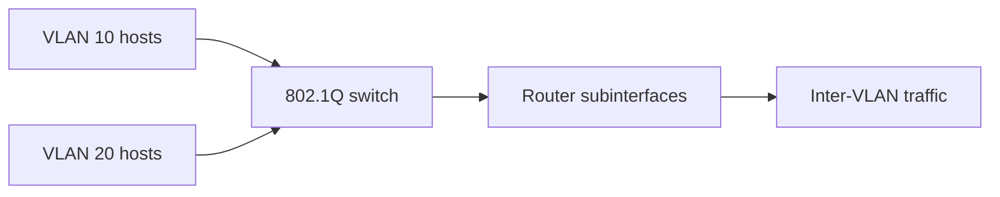

# VLAN Segmentation and Inter-VLAN Routing

## Problem

Departmental hosts need separate broadcast domains, but approved traffic must still cross VLAN boundaries. The switching layer also needs consistent trunking so VLAN traffic can move between switches and reach the router.

## What I built

I completed a sequence of labs that progressed from local VLAN membership to end-to-end routed connectivity:

1. Created and named VLANs across multiple switches.
2. Assigned access interfaces according to departmental membership.
3. Configured switch virtual interfaces for management.
4. Configured a voice VLAN on the required access port.
5. Built static and dynamically negotiated trunks and corrected native-VLAN mismatches.
6. Disabled dynamic negotiation on links intended to remain static.
7. Configured router subinterfaces with 802.1Q encapsulation.
8. Used the router subinterface addresses as the default gateways for their VLANs.
9. Verified same-VLAN and cross-VLAN connectivity.



## Important distinction

VLANs create isolation at Layer 2. A trunk carries frames for multiple VLANs, but it does not route between them. Router-on-a-stick provides Layer 3 forwarding by assigning one tagged router subinterface and gateway address to each VLAN.

## Verification

```text
show vlan brief
show interfaces trunk
show interfaces switchport
show ip interface brief
show running-config interface <router-interface>
ping <same-vlan-host>
ping <different-vlan-host>
```

I verified VLAN existence and access-port placement before testing trunks, then confirmed router subinterfaces were active before performing cross-VLAN pings. This order helps isolate whether a failure is caused by access-port membership, trunk transport, or Layer 3 gateway configuration.

## Skills demonstrated

Network segmentation, 802.1Q trunking, DTP behavior, native-VLAN consistency, voice VLANs, management SVIs, router-on-a-stick, and methodical connectivity testing.

## Lab coverage

- VLAN Configuration
- Configure DTP
- Implement VLANs and Trunking
- Configure Router-on-a-Stick Inter-VLAN Routing
- Inter-VLAN Routing Challenge

See [evidence](evidence) for supporting artifacts.

