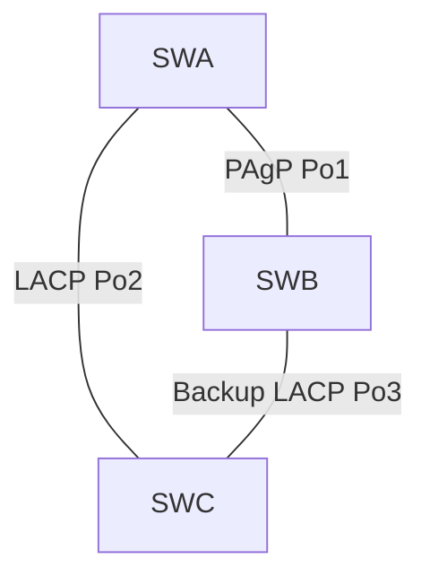

# Layer 2 Resiliency with STP and EtherChannel

## Problem

Redundant switch links improve availability, but parallel Layer 2 paths can create broadcast loops. This project examines how Spanning Tree Protocol creates a loop-free topology and how EtherChannel bundles compatible links into one logical connection.

## What I investigated and configured

### Spanning Tree Protocol

- Inspected the converged spanning-tree instance on three interconnected switches.
- Identified the root bridge and the forwarding or blocking role of each inter-switch port.
- Confirmed that STP intentionally blocked a redundant path.
- Removed an active link and observed the alternate port transition toward forwarding.
- Retested host connectivity after convergence.

### EtherChannel

- Configured all member interfaces as static trunks.
- Built Port-Channel 1 with PAgP between SWA and SWB.
- Built Port-Channel 2 with negotiated LACP between SWA and SWC.
- Built a backup LACP channel between SWB and SWC with one side initiating negotiation.
- Verified that member interfaces joined the correct logical bundles.



## Why the technologies belong together

STP decides which logical Layer 2 paths may forward without creating a loop. EtherChannel combines several physical links into one logical port-channel, allowing additional bandwidth and link redundancy without STP blocking each member link individually.

## Verification

```text
show spanning-tree vlan 1
show etherchannel summary
show interfaces port-channel
show interfaces trunk
```

For STP, the strongest evidence is the port-role/state change after removing a link. For EtherChannel, the summary should show the protocol, port-channel state, and bundled member interfaces.

## Skills demonstrated

STP analysis, convergence testing, Layer 2 failure recovery, trunk configuration, PAgP/LACP negotiation, and EtherChannel validation.

## Lab coverage

- Investigate STP Loop Prevention
- Implement EtherChannel

See [evidence/README.md](evidence/README.md) for supporting artifacts.

