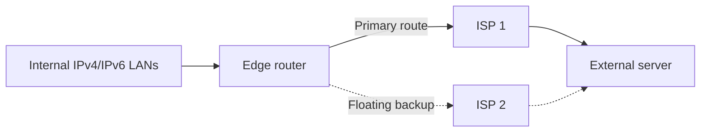

# Dual-Stack Static Routing and Troubleshooting

## Problem

A dual-stack edge network needed deterministic IPv4 and IPv6 paths to internal LANs and an external server. It also required backup routes that would remain inactive until the preferred path failed. A related troubleshooting exercise introduced incorrect or missing routes that prevented end-to-end connectivity.

## What I configured

- IPv4 and IPv6 default routes from the edge router through the primary ISP.
- Floating default routes through the secondary ISP with a higher administrative distance.
- IPv4 and IPv6 routes from ISP routers back to internal LANs.
- Floating return routes for backup reachability.
- IPv4 and IPv6 host routes to a specific external server.
- Corrected faulty static and default routes in a separate dual-stack troubleshooting topology.



## Troubleshooting method

1. Confirmed interface addressing and operational state.
2. Compared the routing table with the addressing plan.
3. Checked destination prefixes, masks/prefix lengths, next hops, exit interfaces, and administrative distance.
4. Tested the next hop before testing remote destinations.
5. Repaired one routing issue at a time and repeated IPv4 and IPv6 tests.

This distinguishes a routing failure from an interface, addressing, or default-gateway problem instead of changing multiple configurations at once.

## Verification

```text
show ip interface brief
show ipv6 interface brief
show ip route
show ipv6 route
show running-config | include route
ping <ipv4-destination>
ping <ipv6-destination>
traceroute <destination>
```

The completed state should show preferred static routes installed normally and floating routes held as backups because of their higher administrative distance. End hosts should reach remote destinations over both IP versions.

## Skills demonstrated

IPv4/IPv6 static routing, default and host routes, floating-route design, administrative distance, route-table interpretation, and evidence-based troubleshooting.

## Lab coverage

- Configure IPv4 and IPv6 Static and Default Routes
- Troubleshoot Static and Default Routes

See [evidence/README.md](evidence/README.md) for supporting artifacts.

