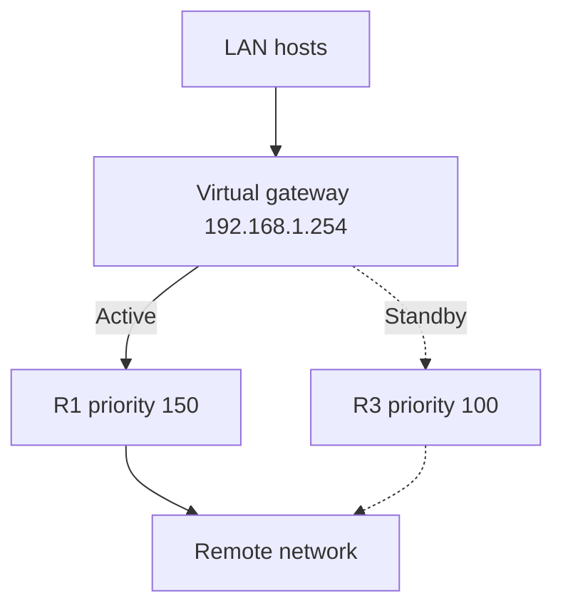

# DHCP and First-Hop Redundancy

## Overview

This category contains two related infrastructure-service labs: centralized DHCP across routed networks and resilient default-gateway service with HSRP. They are documented together as network availability work, but they remain separate topologies and are not presented as one integrated deployment.

## Case 1: Centralized DHCPv4

### Problem

Clients on remote LANs needed automatic IPv4 configuration from a router-based DHCP service located across routed links.

### Implementation

- Excluded the first ten addresses in the remote client networks to protect static assignments.
- Created separate, case-sensitive DHCP pools for the R1 and R3 LANs.
- Supplied the network, default gateway, and DNS server in each pool.
- Configured `ip helper-address` on the client-facing interfaces of R1 and R3.
- Configured an R2 interface as a DHCP client for ISP-side addressing.
- Verified client leases, router interface addressing, and end-to-end reachability.

## Case 2: HSRP gateway redundancy

### Problem

Hosts using a physical router address as their default gateway lost remote connectivity when that router or link failed.

### Implementation

- Configured HSRP version 2 and group 1 on R1 and R3.
- Assigned `192.168.1.254` as the shared virtual gateway.
- Raised R1 priority to 150 so it became active.
- Enabled preemption so R1 could reclaim the active role after recovery.
- Kept R3 at the default priority as the standby router.
- Replaced host physical-router gateways with the HSRP virtual address.
- Verified active/standby state, then tested failure and recovery behavior.



## Verification

```text
show ip dhcp pool
show ip dhcp binding
show ip interface brief
show standby
show standby brief
ping <remote-host>
tracert <remote-host>
```

## Skills demonstrated

DHCP scope planning, address exclusions, DHCP relay, router DHCP clients, FHRP concepts, HSRP election and preemption, virtual IP/MAC behavior, and controlled failover testing.

## Lab coverage

- Configure DHCPv4
- HSRP Configuration Guide

See [evidence/README.md](evidence/README.md) for supporting artifacts.

